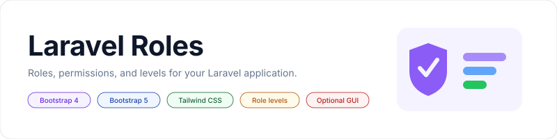

<p align="center">
    <picture>
        <source media="(prefers-color-scheme: dark)" srcset="art/banner-dark.svg">
        <source media="(prefers-color-scheme: light)" srcset="art/banner-light.svg">
        
    </picture>
</p>

<p align="center">Role-Based Access Control (RBAC) for Laravel. Roles, permissions and role levels. Supports Laravel 5.3 through 13.</p>

<p align="center">
    <a href="https://github.com/jeremykenedy/laravel-roles/actions/workflows/tests.yml"></a>
    <a href="https://packagist.org/packages/jeremykenedy/laravel-roles"></a>
    <a href="https://packagist.org/packages/jeremykenedy/laravel-roles"></a>
    <a href="https://github.styleci.io/repos/82768379"></a>
    <a href="https://sonarcloud.io/summary/new_code?id=jeremykenedy_laravel-roles"></a>
    <a href="https://www.codefactor.io/repository/github/jeremykenedy/laravel-roles"></a>
    <a href="https://scrutinizer-ci.com/g/jeremykenedy/laravel-roles/build-status/master"></a>
    <a href="https://scrutinizer-ci.com/g/jeremykenedy/laravel-roles/?branch=master"></a>
    <a href="https://scrutinizer-ci.com/code-intelligence"></a>
    <a href="https://opensource.org/licenses/MIT"></a>
    <a href="https://madewithlaravel.com/p/laravel-roles/shield-link"></a>
</p>

<p align="center">
    <a href="https://app.aikido.dev/repositories/3220428"></a>
</p>

## Table of contents

- [Features](#features)
- [Framework support](#framework-support)
- [Requirements](#requirements)
- [Installation](#installation)
    - [Composer](#composer)
    - [The trait](#the-trait)
    - [Migrations](#migrations)
    - [Seeding](#seeding)
- [Quick start](#quick-start)
- [Documentation](#documentation)
- [Configuration](#configuration)
- [The optional GUI](#the-optional-gui)
- [Changing frameworks](#changing-frameworks)
- [Artisan commands](#artisan-commands)
- [Screenshots](#screenshots)
- [Testing](#testing)
- [License](#license)

## Features

- Roles with levels, and permissions attached to roles or directly to users
- Permission inheritance from lower level roles, which can be turned off
- Entity checks, so a user can act on a model they own without a permission
- Four Blade directives and three route middleware
- Soft deletes with restore and force delete
- An optional CRUD interface in Bootstrap 4, Bootstrap 5 or Tailwind CSS
- An optional JSON API
- Every table name, model and behaviour configurable from the environment

## Framework support

The optional GUI ships three complete view sets. Exactly one is active at a
time, chosen with `ROLES_CSS_FRAMEWORK`.

| Framework | Value | Front end it expects |
| :--- | :--- | :--- |
| Bootstrap 4 | `bootstrap4` (default) | Bootstrap 4 CSS and JS, jQuery |
| Bootstrap 5 | `bootstrap5` | Bootstrap 5 CSS and JS, no jQuery required |
| Tailwind CSS | `tailwind` | Tailwind CSS, Alpine.js, class based dark mode |

Bootstrap 4 is the default and is the markup this package has always shipped,
so upgrading does not change the look of an existing install.

## Requirements

| Requirement | Version |
| :--- | :--- |
| PHP | 7.2 or newer |
| Laravel | 5.3 through 13 |

Continuous integration covers PHP 8.2 through 8.4 on Laravel 12 and 13.

## Installation

### Composer

```bash
composer require jeremykenedy/laravel-roles
```

The service provider is discovered automatically.

### The trait

Add the trait to the model `auth.providers.users.model` points at:

```php
use Illuminate\Foundation\Auth\User as Authenticatable;
use jeremykenedy\LaravelRoles\Traits\HasRoleAndPermission;

class User extends Authenticatable
{
    use HasRoleAndPermission;
}
```

### Migrations

Run the shipped migrations by turning them on:

```dotenv
ROLES_MIGRATION_DEFAULT_ENABLED=true
```

```bash
php artisan migrate
```

Or publish them first and keep them under your own version control:

```bash
php artisan vendor:publish --tag=laravelroles-migrations
php artisan migrate
```

### Seeding

Publish the seeders and call them from your own `DatabaseSeeder`:

```bash
php artisan vendor:publish --tag=laravelroles-seeds
composer dump-autoload
php artisan db:seed
```

Full detail, including running the shipped seeders without publishing, is in
[the seeding guide](docs/seeding.md).

## Quick start

```php
use jeremykenedy\LaravelRoles\Models\Permission;
use jeremykenedy\LaravelRoles\Models\Role;

$admin = Role::create([
    'name'        => 'Admin',
    'slug'        => 'admin',
    'description' => 'Full access',
    'level'       => 5,
]);

$permission = Permission::create([
    'name'  => 'Can Edit Users',
    'slug'  => 'edit.users',
    'model' => 'Permission',
]);

$admin->attachPermission($permission);
$user->attachRole($admin);
```

Then check it:

```php
$user->hasRole('admin');            // true
$user->hasPermission('edit.users'); // true
$user->level();                     // 5
$user->isAdmin();                   // true
$user->canEditUsers();              // true
```

In a view:

```blade
@role('admin')
    Only an admin sees this.
@endrole
```

On a route:

```php
Route::get('/admin', fn () => view('admin'))->middleware('role:admin');
```

## Documentation

Full documentation lives in [the docs folder](docs/README.md).

| Guide | Covers |
| :--- | :--- |
| [Installation](docs/installation.md) | Composer, the trait, migrations, publishing |
| [Configuration](docs/configuration.md) | Every config key and its environment variable |
| [Roles](docs/roles.md) | Creating, attaching, syncing and checking roles |
| [Permissions](docs/permissions.md) | Role and direct permissions, entity checks |
| [Levels and inheritance](docs/levels-and-inheritance.md) | How `level()` and inheritance behave |
| [Blade and middleware](docs/blade-and-middleware.md) | The directives, the middleware, the exceptions |
| [GUI](docs/gui.md) | Turning the interface on and picking a framework |
| [Artisan commands](docs/artisan-commands.md) | `roles:install`, `roles:update`, `roles:switch` |
| [API](docs/api.md) | The optional JSON endpoints |
| [Seeding](docs/seeding.md) | The bundled seeders and how to run them |
| [Testing](docs/testing.md) | Running the suite and what it covers |
| [Upgrading](docs/upgrading.md) | What changed and what to do about it |

## Configuration

```bash
php artisan vendor:publish --tag=laravelroles-config
```

Every option reads from an environment variable, so most installs never edit
the config file. The ones reached for most often:

| Variable | Default | Purpose |
| :--- | :--- | :--- |
| `ROLES_GUI_ENABLED` | `false` | Turn the CRUD interface on |
| `ROLES_CSS_FRAMEWORK` | `bootstrap4` | Which view set the GUI renders |
| `ROLES_API_ENABLED` | `false` | Turn the JSON API on |
| `ROLES_INHERITANCE` | `true` | Inherit permissions from lower level roles |
| `ROLES_MIGRATION_DEFAULT_ENABLED` | `false` | Run the shipped migrations |
| `ROLES_DEFAULT_SEPARATOR` | `.` | Slug and magic method separator |
| `ROLES_GUI_MIDDLEWARE` | `role:admin` | Who may reach the GUI |

The complete list, including every table name, model, front end asset and
access control option, is in [the configuration guide](docs/configuration.md).

## The optional GUI

```dotenv
ROLES_GUI_ENABLED=true
```

That registers the CRUD routes for roles and permissions, including the soft
delete dashboards. The views extend the layout named by
`ROLES_GUI_BLADE_EXTENDED`, which defaults to `layouts.app`, and your layout
needs to yield the sections the views render into:

```blade
@yield('inline_template_linked_css')
...
@yield('inline_footer_scripts')
```

Access is gated by Laravel's `auth` middleware and by `role:admin`, both of
which are configurable. See [the GUI guide](docs/gui.md) for the full route
list and access control options.

## Changing frameworks

After installation, use **update** or **switch** to change the CSS framework
without losing configuration.

### Update (interactive)

```bash
php artisan roles:update
```

Or pass the option directly:

```bash
php artisan roles:update --css=bootstrap5
```

| Option | Values | Description |
| :--- | :--- | :--- |
| `--css` | `bootstrap4`, `bootstrap5`, `tailwind` | Change the CSS framework |

### Switch (quick)

```bash
php artisan roles:switch --css=tailwind
```

If you published the views, republish them for the framework you moved to:

```bash
php artisan vendor:publish --tag=laravelroles-views-tailwind --force
```

## Artisan commands

| Command | Description |
| :--- | :--- |
| `roles:install` | Fresh install with interactive prompts. Detects an existing installation. |
| `roles:update` | Change the framework interactively. Does not overwrite config or published views. |
| `roles:switch` | Quick framework change from a flag. |

### Install options

| Flag | Description |
| :--- | :--- |
| `--css=` | CSS framework: `bootstrap4`, `bootstrap5`, `tailwind` |
| `--force` | Skip the reinstall confirmation when already installed |

Passing `--css` skips the prompts, so the commands work unattended in a deploy
script. Full detail in [the commands guide](docs/artisan-commands.md).

## Screenshots

These show the Bootstrap 4 interface.

| Roles dashboard | Create a role |
| :---: | :---: |
|  |  |

| Edit a role | Role detail |
| :---: | :---: |
|  |  |

| Delete a role | Deleted role detail |
| :---: | :---: |
|  |  |

| Restore a role | Deleted roles dashboard |
| :---: | :---: |
|  |  |

| Permissions dashboard | Create a permission |
| :---: | :---: |
|  |  |

| Permission detail | Deleted permissions dashboard |
| :---: | :---: |
|  |  |

## Testing

```bash
composer test
composer lint
```

See [the testing guide](docs/testing.md) for what the suite covers.

## License

This package is open-sourced software licensed under the [MIT license](LICENSE).
